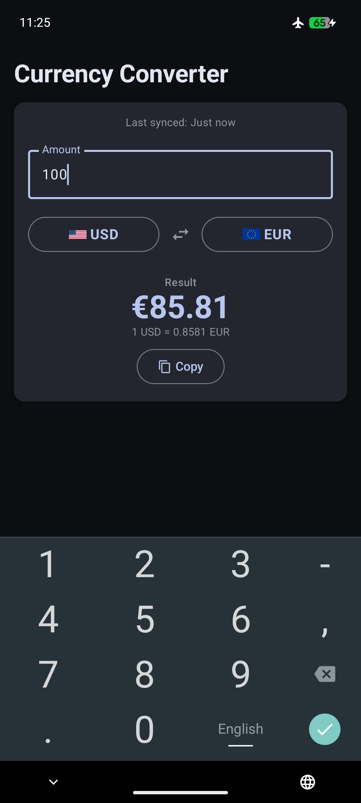
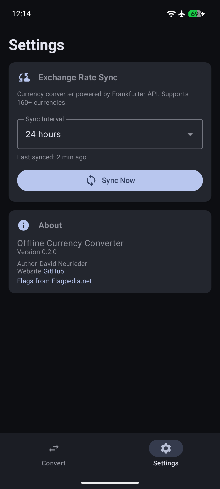
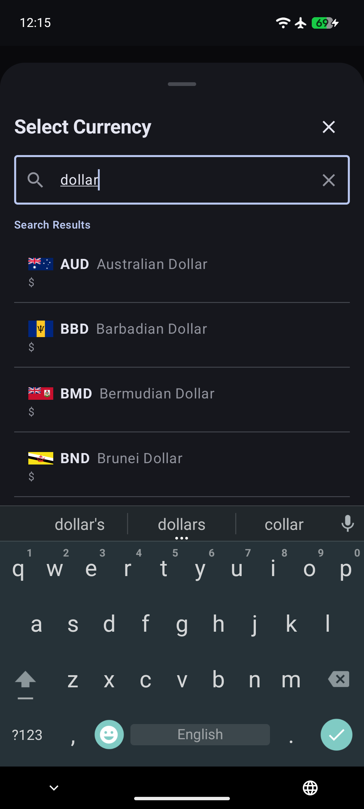

# Offline Currency Converter

**Version:** 0.2.1

[](https://f-droid.org/packages/com.offlinecurrencyconverter.app/)

A privacy-focused currency converter for Android that works completely offline. No account, no tracking, no analytics — just exchange rates in your pocket.

## How It Works

The app fetches exchange rates from the free [Frankfurter API](https://frankfurter.app) (powered by the European Central Bank) and stores them locally using Room. Once synced, all conversions happen entirely offline. You can configure the sync interval in settings (6h, 12h, 24h, 48h, or weekly), and a background WorkManager job keeps rates up to date.

## Features

- **100% offline** — no internet required after initial sync
- **160+ currencies** — all ECB reference rates
- **Copy result** — tap to copy any conversion to clipboard
- **Pull-to-refresh** — manually trigger a rate sync from the convert screen
- **Bundled flags** — country flags are built into the app, no network loading
- **Material Design 3** — modern UI with dynamic theming
- **Privacy first** — no accounts, no tracking, no network permissions at runtime

## Screenshots

   

## Building

```bash
# Debug build
./gradlew assembleDebug

# Release build
./gradlew assembleRelease
```

The release APK will be at `app/build/outputs/apk/release/app-release.apk`

> **Note for F-Droid:** This project follows the [F-Droid Reproducible Builds](https://f-droid.org/en/docs/Reproducible_Builds/) guidelines. Minification (R8/ProGuard) is disabled to ensure deterministic output.

## Permissions

The app declares the following permissions:
- `INTERNET` and `ACCESS_NETWORK_STATE` — used only by WorkManager for background exchange rate sync
- `RECEIVE_BOOT_COMPLETED`, `WAKE_LOCK`, `FOREGROUND_SERVICE` — used by WorkManager to schedule syncs after reboot

No data leaves your device during conversion; only rate syncs contact the Frankfurter API.

## Tech Stack

- **Language:** Kotlin
- **UI:** Jetpack Compose with Material 3
- **Architecture:** MVVM + Clean Architecture
- **DI:** Hilt
- **Database:** Room
- **Networking:** Retrofit + OkHttp
- **Background:** WorkManager
- **Build:** Gradle (Kotlin DSL)

## License

AGPLv3 — See [LICENSE](./LICENSE)
